# 软件说明书（中期 / 结项共用主文档）

---

## 基本信息

**项目名称：** 智慧农业信息管理系统  
**学    院：** 创业学院  
**小组序号：** 7  
**成员姓名：** 丁珉宇、陈皓宇、周俊、肖维  
**指导老师：** 尹兆远  
**当前版本：** 中期版  
**更新日期：** 2026年5月4日  

---

## 一、项目概述

### 1. 项目背景

随着物联网技术在农业领域的推广，传统大棚的人工巡检模式已无法满足现代化种植对数据实时性和准确性的需求。本项目依托三个实体大棚场景，搭建一套集数据采集、存储、可视化于一体的信息管理系统，实现大棚环境的远程监控与数据化管理。

### 2. 系统目标

1. 打通硬件传感器到数据库的数据链路，支持多大棚、多点位、多类型传感器的统一接入。  
2. 提供可视化大屏展示大棚实时环境数据与历史趋势。  
3. 实现设备管理、用户权限、数据查询等后台管理功能。  
4. 提供**微信小程序端**能力：认养者查看地块与发起作业、操作员处理待审任务、访客受限体验，与同一套后端 API、MQTT 设备状态联动。

### 3. 开发环境

| 类别 | 说明 |
|------|------|
| 开发工具 | IntelliJ IDEA、VS Code、Navicat、微信开发者工具 |
| 数据库 | MySQL 8.0 |
| 运行环境 | JDK 17、Node.js 18、Mosquitto MQTT Broker |
| 小程序端 | Taro 4、React 18、TypeScript、SCSS；`pnpm` 构建；支持微信小程序与 H5 预览联调 |
| 版本管理 | Git、GitHub |
| 操作系统 | Windows 10 / 11（本地开发与联调） |

---

## 二、需求分析

### 1. 功能需求

#### 1.1 目标用户与功能清单

| 角色 | 主要功能 |
|------|----------|
| 大棚管理员 | PC 端大屏查看实时传感器数据、管理设备 |
| 农场数据分析员 | 查看整体运营数据、历史趋势、导出报表 |
| 系统管理员 | 用户与权限、各类基础数据管理 |
| 认养者（小程序） | 微信或 H5 登录；认养码/订单与地块浏览；发起作业任务（含可选交由运营审核）；查看任务状态 |
| 操作员（小程序） | 待审核任务列表、通过/拒绝；按责任域「全部 / 仅我的」筛选；与后台责任域配置联动 |
| 访客（小程序） | 受限入口浏览或体验（按产品配置） |

系统核心功能包括：大棚与点位管理（增删改查）；传感器设备管理与在线状态监控；实时数据采集（MQTT）与历史数据存储；可视化大屏（ECharts 图表、实时折线图）；数据导出与查询；**上述小程序端认养与作业协同能力**。

#### 1.2 主要业务流程

**图 2-1 主要业务流程**

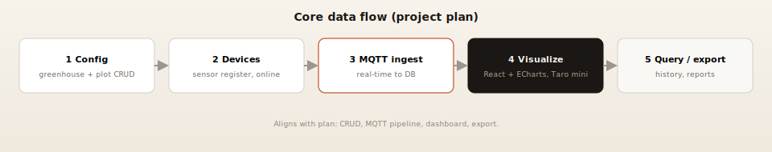

1. **大棚与点位配置**：在系统中维护大棚及下属点位等基础信息。  
2. **设备接入与状态**：完成传感器设备注册、参数与在线状态维护。  
3. **MQTT 采集与入库**：网关或边缘节点经 MQTT 上报数据，后端订阅、解析并写入数据库。  
4. **可视化展示**：PC 管理端通过 REST（及计划中的 WebSocket）获取数据，大屏与图表展示实时与历史曲线。  
5. **查询与导出**：数据分析员按条件查询历史数据并导出报表。  
6. **小程序侧闭环**：认养者提交任务后，经服务层写入 `operation_task`；需人工审核时由操作员在小程序工作台处理；设备在线态影响小程序端「可执行」类操作的提示。

### 2. 非功能需求

- **性能要求**：支持 100+ 传感器并发上报，页面响应时间小于 1 秒；小程序首屏与列表滚动保持流畅。  
- **安全要求**：用户密码加密存储；**接口鉴权**采用 Sa-Token 与 Redis 会话（与计划书中 JWT 鉴权目标一致）；MQTT 侧可配置用户名密码认证；小程序端按角色调用接口，与后台权限模型一致。  
- **兼容性要求**：Chrome / Edge 等现代浏览器，响应式布局适配大屏与 PC；**微信小程序基础库**与开发者工具版本与 Taro 编译目标一致；必要时通过 H5 预览完成联调。  

---

## 三、系统设计

### 1. 系统架构

系统采用**前后端分离 + 物联网接入**的总体架构，与《项目计划书》一致：

- **感知层**：传感器经主控网关通过 MQTT 上报遥测数据。  
- **服务层**：Spring Boot 订阅 MQTT、解析并持久化至 MySQL，对外提供 REST API，完成鉴权与业务规则。  
- **展示层**：**PC 管理端** 采用 **React + Vite + TypeScript**，结合 ECharts 做数据可视化（《项目计划书》规划为 Vue 3 + Element Plus，当前工程选用 React 实现同类 SPA 管理端）。**移动端** 采用 **Taro + React** 输出微信小程序（及 H5 预览），与同一 REST 后端交互，承载认养、任务与运营审核等高频场景；计划中可采用 WebSocket 增强实时推送。  

**图 3-1 系统总体架构**

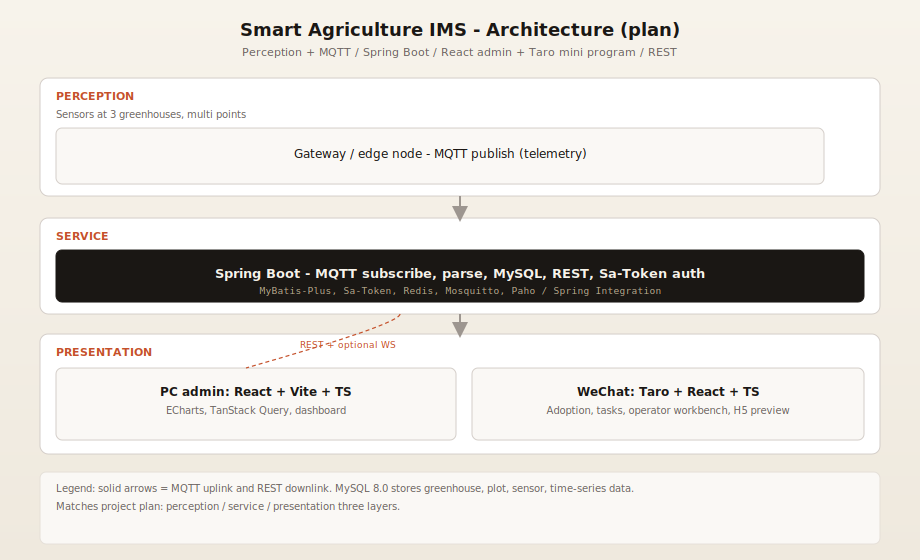

图中自上而下对应计划书中的感知层、服务层、展示层；数据持久化采用 MySQL 8.0。小程序端与 PC 管理端同属展示层，共用服务层接口与鉴权体系。

### 2. 模块设计

| 模块 | 职责 |
|------|------|
| 大棚与点位管理 | 大棚、点位的增删改查及基础属性维护 |
| 设备管理 | 传感器设备档案、在线状态、与点位绑定关系 |
| 数据采集与存储 | MQTT 接入、报文解析、传感器时序数据入库 |
| 可视化大屏 | ECharts 实时曲线、历史趋势、大屏布局 |
| 权限与用户 | 用户、角色及 Sa-Token 会话鉴权相关能力 |
| 查询与导出 | 条件查询、报表导出 |
| 微信小程序端 | 登录与角色路由；认养与地块、任务创建与流转；操作员工作台与责任域筛选；与后端任务表、设备在线状态联动展示 |

### 3. 数据库设计

#### 3.1 E-R 图

**图 3-2 数据库 E-R 图（逻辑）**

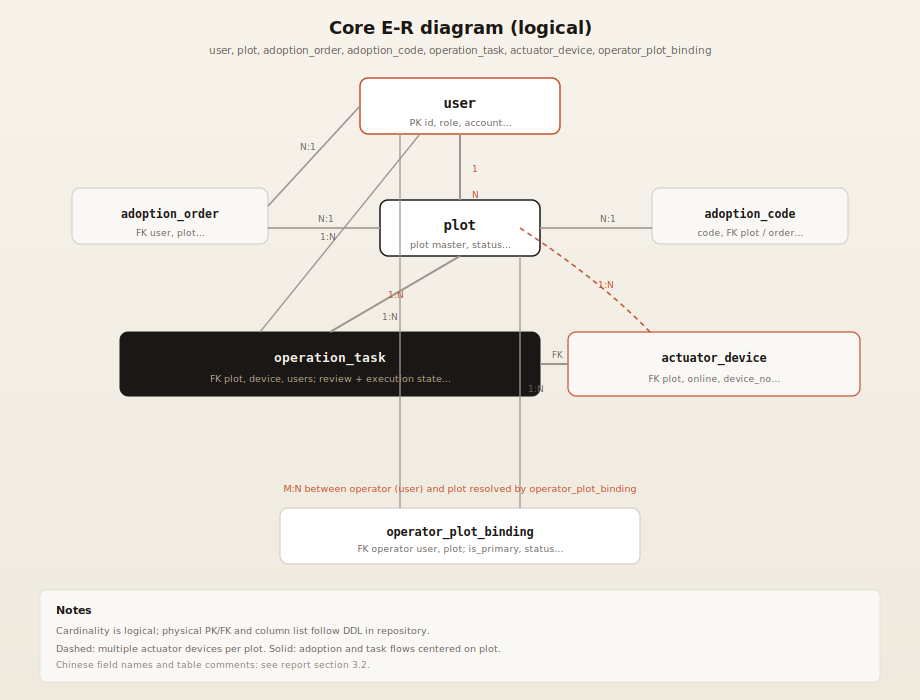

图中为工程侧**核心业务库表**逻辑关系（与实现代码一致）：`user`（用户与角色）、`plot`（地块）、`adoption_order` / `adoption_code`（认养订单与认养码）、`operation_task`（作业任务）、`actuator_device`（执行设备）、`operator_plot_binding`（操作员责任域）。实线为主业务关联，橙色虚线表示同一地块可挂载多台执行设备；操作员与地块的多对多经绑定表解析。

计划书中大棚、传感器、时序数据等实体，可在物理库中与 `plot`、设备类表做映射或分表扩展，本图突出当前已落地的认养与作业闭环。

#### 3.2 主要数据表设计（摘要）

| 表名（逻辑） | 用途说明 |
|--------------|----------|
| user | 用户基础信息与角色 |
| plot | 地块主数据 |
| adoption_order / adoption_code | 认养订单与认养凭证 |
| actuator_device | 执行设备、在线状态、与地块等关联 |
| operation_task | 作业任务：执行状态、审核状态、风险与指派等 |
| operator_plot_binding | 操作员责任域：地块绑定、主责、状态等 |
| （扩展）greenhouse / sensor_device / sensor_data | 与计划书一致的大棚与传感时序模型，可与上表并存或映射 |

---

## 四、系统实现

### 1. 关键技术

1. **后端**：Spring Boot 3、MyBatis-Plus、**Sa-Token**（结合 Redis）、订阅 Mosquitto MQTT，经 Paho / Spring Integration 完成消息收发与解析入库。  
2. **PC 管理端**：React、Vite、TypeScript、ECharts、TanStack Query；管理后台与大屏数据联动展示。  
3. **小程序端**：Taro 4.x、React 18、TypeScript；使用封装请求调用后端 REST；微信开发者工具真机调试与 **H5 预览**（仓库脚本如 `pnpm build:h5`、`pnpm preview:h5`，以 `miniapp/package.json` 为准）。  
4. **联调策略**：按计划书风险应对，采用 MQTT 模拟器与脚本，在真实硬件未全部到位时仍可完成服务层与库表联调；小程序与后端在同一局域网或配置合法域名后联调。  

### 2. 界面展示

| 界面 | 说明 |
|------|------|
| 可视化大屏 | 多棚环境实时数据、ECharts 折线图与关键指标 |
| 管理后台 | 大棚与点位、设备、用户与权限配置 |
| 数据分析与查询 | 历史趋势、条件查询与导出入口 |

以下为系统实际运行截图，与 `数据库实践md/assets` 目录一并提交或打包后即可正常显示。

**图 4-1 管理端登录**

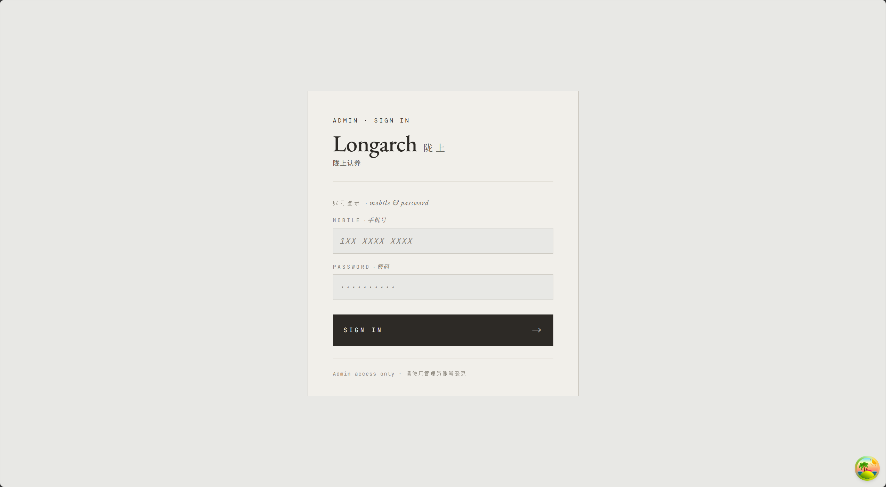

**图 4-2 管理端仪表总览**

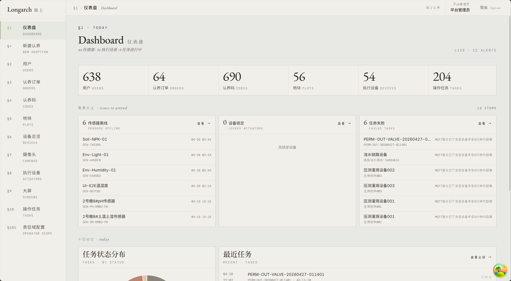

**图 4-3 传感器 / 设备数据界面**

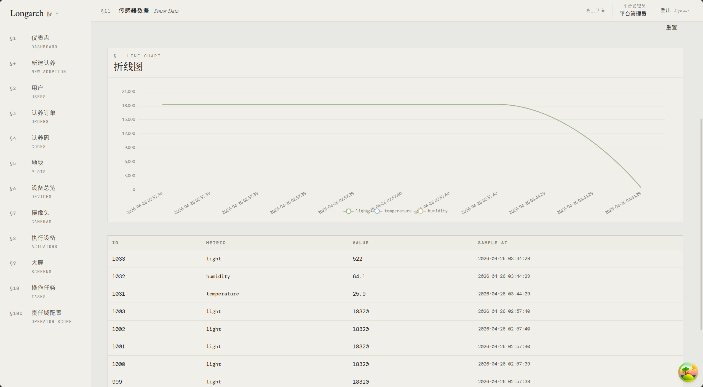

**图 4-4 可视化大屏**

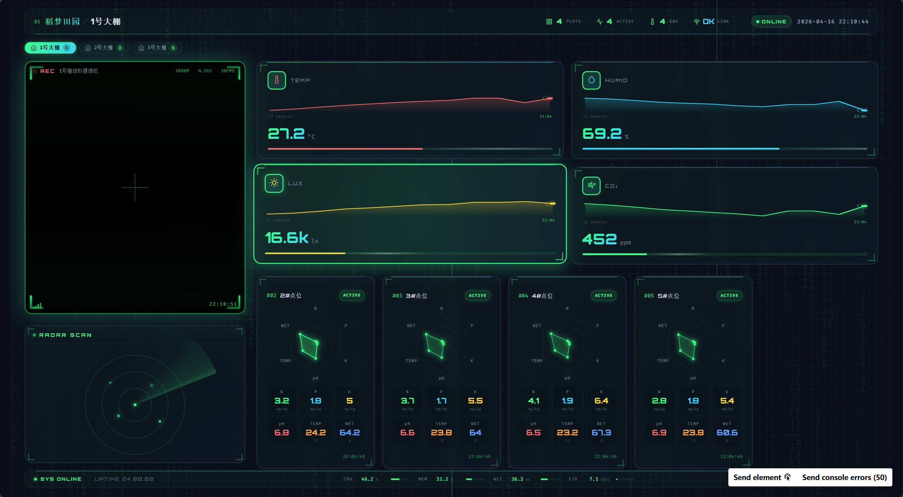

### 3. 核心代码片段

本节列出关键实现位置，便于对照仓库源码阅读。

- **MQTT 接入与解析**：Spring Boot 中订阅主题、解析负载并写入传感器数据或设备状态相关表的监听器或服务类。  
- **安全与鉴权**：Sa-Token 登录、会话与角色校验；管理端与小程序请求与后端接口鉴权规则一致。  
- **数据访问层**：MyBatis-Plus 对 `operation_task`、`operator_plot_binding`、`actuator_device` 等实体的 Mapper 与条件查询。  
- **小程序页面与请求**：`miniapp` 工程中任务页、工作台等页面组件，及封装后的 `fetch`/业务 API 调用层。  

---

## 五、系统测试

### 1. 测试方案

| 项目 | 说明 |
|------|------|
| 测试方法 | 功能测试为主，MQTT 与数据库链路采用模拟器与手工校验相结合 |
| 测试范围 | 大棚与点位 CRUD、设备在线状态、MQTT 上报或设备回调后库表更新、管理端数据刷新、**登录与权限**、查询与导出；**小程序**登录、认养浏览、任务创建、操作员审核与责任域筛选、H5 预览下接口与错误提示 |
| 测试环境 | JDK 17、Node.js 18、MySQL 8.0、Mosquitto、Spring Boot、**React 管理端**；**微信开发者工具**或 **H5 预览地址** + 已启动后端 |
| 通过准则 | 主流程可重复执行，阻塞级缺陷为 0；一般缺陷有记录与修复安排 |

**表 5-1 计划测试用例**

| 编号 | 用例名称 | 前置条件 | 预期结果 |
|------|----------|----------|----------|
| TC-01 | 管理员登录 | 合法账号 | 鉴权通过，进入管理后台 |
| TC-02 | 大棚与点位维护 | 已登录 | 增删改查成功，库表一致 |
| TC-03 | 设备注册与在线 | 已有点位 | 设备状态展示正确 |
| TC-04 | MQTT 上报或设备回调 | 模拟器或网关在线 | 数据库中设备状态或业务相关记录更新正确，时间戳合理 |
| TC-05 | 大屏数据展示 | 已有历史数据 | 图表与实时刷新符合预期 |
| TC-06 | 小程序认养者创建任务 | 已登录、地块可用、设备在线（若业务要求） | 任务落库，状态与策略正确 |
| TC-07 | 小程序操作员审核 | 有待审任务、已绑定责任域 | 审核结果回写，列表与状态一致 |

### 2. 测试结果

| 编号 | 执行情况 | 结果摘要 |
|------|----------|----------|
| TC-01～TC-07 | 已部分执行 | PC 与小程序主流程可复现，细节用例持续补充 |

### 3. 问题与改进

| 问题描述 | 改进措施 | 计划完成时间 |
|----------|----------|--------------|
| 部分边界场景（弱网、高频上报）覆盖不足 | 补充用例与限流策略 | 验收前 |
| 大屏样式与交互仍可优化 | 统一设计规范、迭代组件 | 验收前 |
| 当前联调以模拟器与脚本为主，实体传感器尚未全量接入 | 按场地条件分阶段接入硬件，并保持 MQTT 模拟回归 | 持续 |

---

## 六、用户手册

1. **安装部署说明**：JDK 17、Node.js 18、MySQL 8.0、Mosquitto 安装与配置；后端 `application` 配置数据库与 MQTT；PC 前端 `npm`/`pnpm` 安装依赖并构建；**小程序**：在 `miniapp` 目录安装依赖，配置合法请求域名与后端地址，使用微信开发者工具导入编译产物或使用 **H5 预览** 联调；可选用 Docker 部署，环境变量由部署方管理。  
2. **操作指南**：管理员登录后维护大棚、点位与设备；大屏端查看实时与历史数据；分析员执行查询与导出；**认养者**在小程序中完成登录、认养相关浏览与发起任务；**操作员**在工作台处理待审任务并切换责任域视图。  

---

## 七、项目总结

### 1. 成果总结（截至中期）

已按计划完成需求与设计定稿的主要部分：数据库逻辑模型与核心表结构、Spring Boot 服务层与 MQTT 接入链路、**React 管理端**雏形及图表联调；**微信小程序（Taro）端**认养、任务与运营审核流程已与后端联调；三个大棚场景的数据链路在本地可演示。

### 2. 不足与改进方向

1. 测试用例与自动化回归需继续补全。  
2. 性能需在传感器高并发场景下做专项验证。  
3. WebSocket 实时推送与生产环境 HTTPS 等待结项阶段固化。  
4. 小程序真机体验与体验版发布流程、分包体积与审核材料可在结项前进一步完善。  

### 3. 成员分工表

| 姓名 | 班级 | 学号 | Git 账号 | 承担任务 |
|------|------|------|----------|----------|
| 丁珉宇 | 计算机科学与技术创业菁英班 | 202405550305 | minyuding | 前端设计，小程序，后端，组长 |
| 陈皓宇 | 计算机科学与技术创业菁英班 | 202405550325 | chy051128 | Web 前端、文档 |
| 周俊 | 计算机科学与技术创业菁英班 | 202405550307 | ZJ.mkbk | 数据库 |
| 肖维 | 计算机科学与技术创业菁英班 | 202405550304 | xw-wei | 联调、测试与辅助开发 |

### 4. Git 提交记录

**图 7-1 工程仓库提交记录**

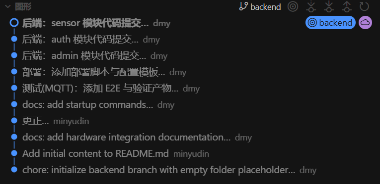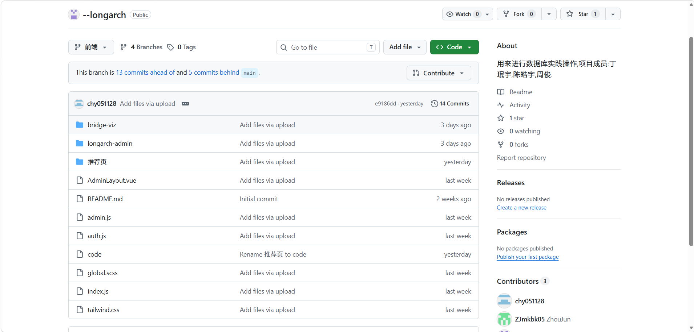
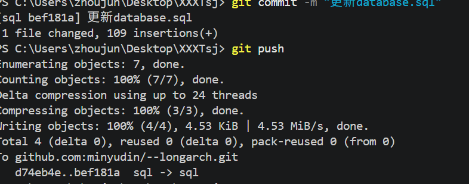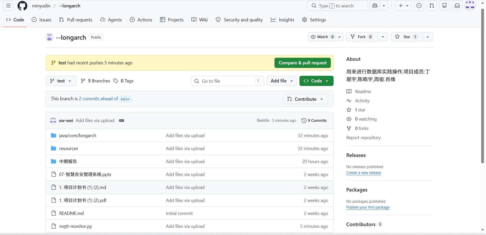

远端仓库与计划书附录一致：`https://github.com/minyudin/--longarch`  

---

## 附录

- **参考资料**：Spring Boot、Sa-Token、MyBatis-Plus、MySQL、MQTT、React、Vite、ECharts、**Taro**、**微信小程序**开发文档等。  
- **源代码仓库链接**：https://github.com/minyudin/--longarch  
- **其他补充材料**：数据库脚本导出、接口说明、答辩 PPT 等。  
